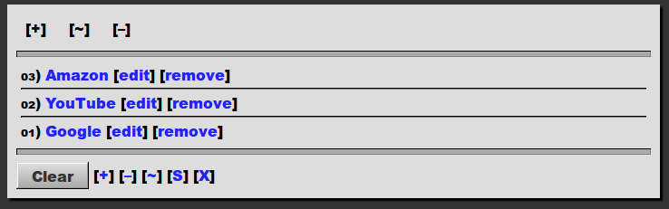
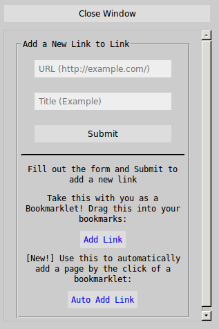
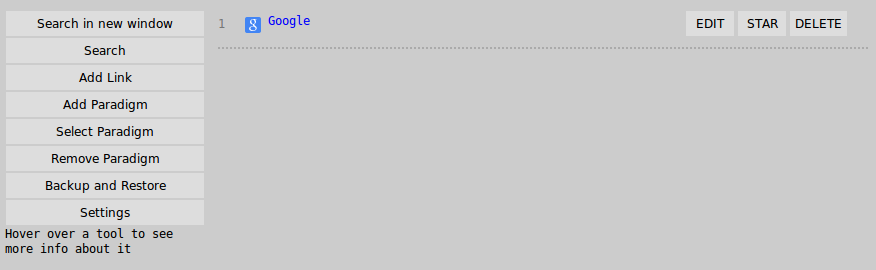
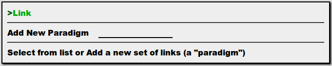

# Link Saver by Braden Best

The Link Saver is a project I made to replace bookmarks and provide a clean UI instead. Cause in my opinion, browser bookmark systems suck.

## What's new

This version is a major improvement over the `1.x` versions. This begins the `2.x` branch of link saver because the data storage method was overhauled from the ground up to use JSON, meaning it is incompatible and thus, under semantic versioning, it gets a new major version.

## New Features

Relatively speaking, of course.

### New storage uses "less vars"

Changed from storing every bleeding html node into their own localStorage entry to storing all the links and URLs from one paradigm into its own entry.

Still uses way too many vars, but it's a start.

### New UI

Much prettier, less obnoxious user interface that attempts to explain itself on first run.

Well, never mind on that note, it still has the [mystery meat](http://en.wikipedia.org/wiki/Mystery_meat_navigation) [+] [~] and [-] buttons

I was going to name the next version 2.1.0, but I noticed that it yet again changed the data model, so it's going to be 3.0.0.

## Data

From Link_Saver.html

    1)	X: Object: {
		      link.0:{
			      link:[link],
			      title:[title],
			      removed[true/false]:
		      },
		      ...
	      }
    2)	LSPAR: Object: {
		      key:[key], (this controls X)
		      list:{
			      [listitem]:[listitem],
			      ...
		      }
	      }

