# Link Saver by Braden Best

The Link Saver is a project I made to replace bookmarks and provide a clean UI instead. Cause in my opinion, browser bookmark systems suck.

## Link Saver Version 5

This is the current version of the link saver. In terms of functionality, I admit there are some parts that have not been fixed. Such as the email confirmation stage--it's fucked up because I just copy/pasted the PHP codebase from version 4.1.0 without adjusting it to fit the app.

I mean, the app works great! I use it daily. It just has some quirks.

In terms of quality, I think version 5.0.0 is more or less on the same level as 4.1.0. It's just has a prettier UI and some other changes.

Here's some screenshots:

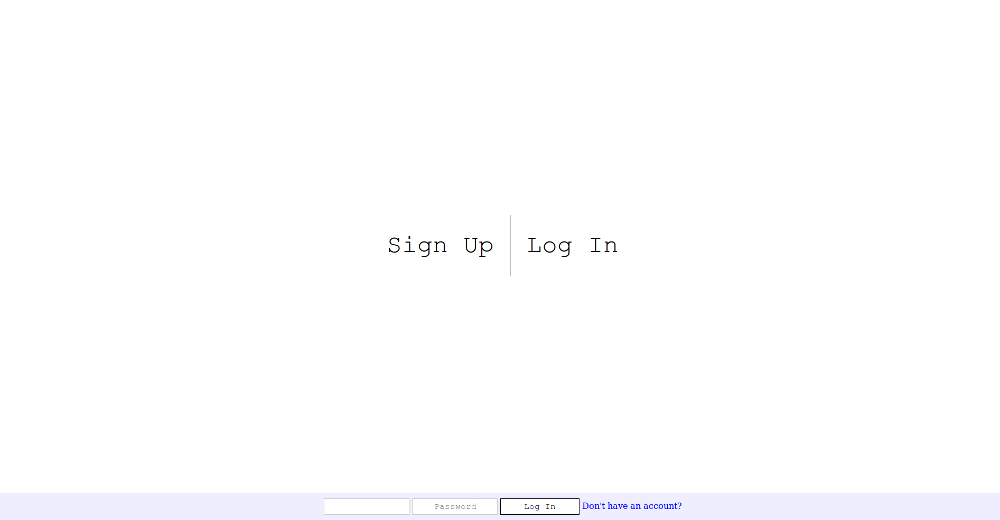

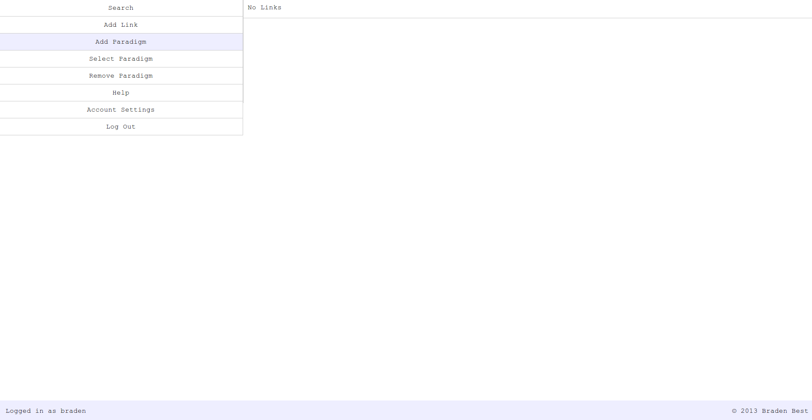

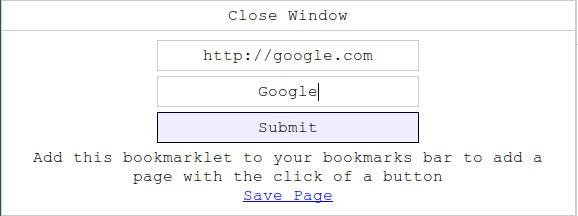

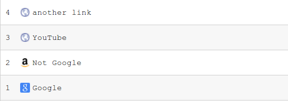

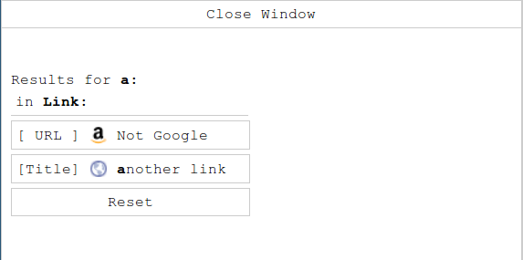

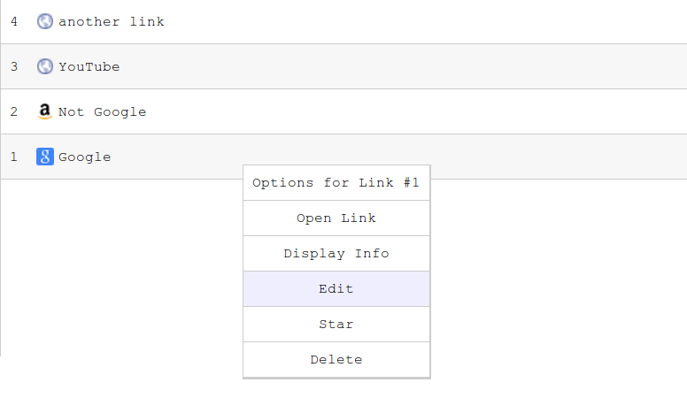

### Setup

1. create a database, and import Link_Saver.sql into it
2. edit src/config.php
3. rename the `/src` directory to the url to access the app (e.g. naming it `/linksaver5` and putting it in the main docs folder of example.com will make it accessible at `http://example.com/linksaver5`)
4. Go live

There's a default user called share, it's meant to be the "wikipedia sandbox" of the site. Credentials:

    Username: share
    Password: 

That is--leave the password field blank.

If you can log into that account, and see this:

    1 Example Link

Then you've successfully set it up.

### Features

* Improved UI
* Better help pages, documentation
* Two companion apps
  * Link Converter
  * Cli
* Has the most efficient JSON model out of all the versions
* More ways to save a link (see src/Client/Help.html)

### Issues

* Email verification system is broken, so I disabled the "un-verified" access block. (low priority)
* Does not properly utilize MySQL, and still just saves a JSON string. (wontfix)
* I just found out that the postcap.php page is nonexistent, so the captcha form fails to complete

## Link Converter

This is a companion app I made that has support for exporting to the Link Saver, specifically version 5.

It also works as a standalone webapp, that can even be used as an alternative to the Link Saver.

It is very lightweight, because all it is, is a text area and a few buttons. Its interface is very different from that of the Link Saver.

Thanks to [Cyberdevil](cyberdevil.newgrounds.com) for suggesting this app in the first place.

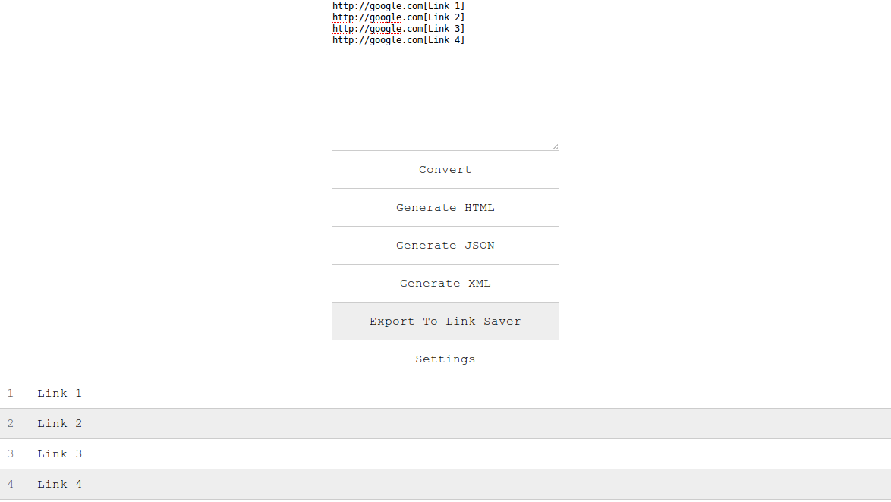

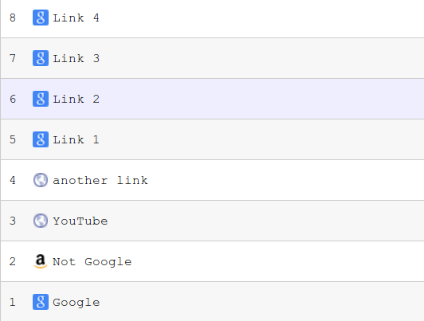

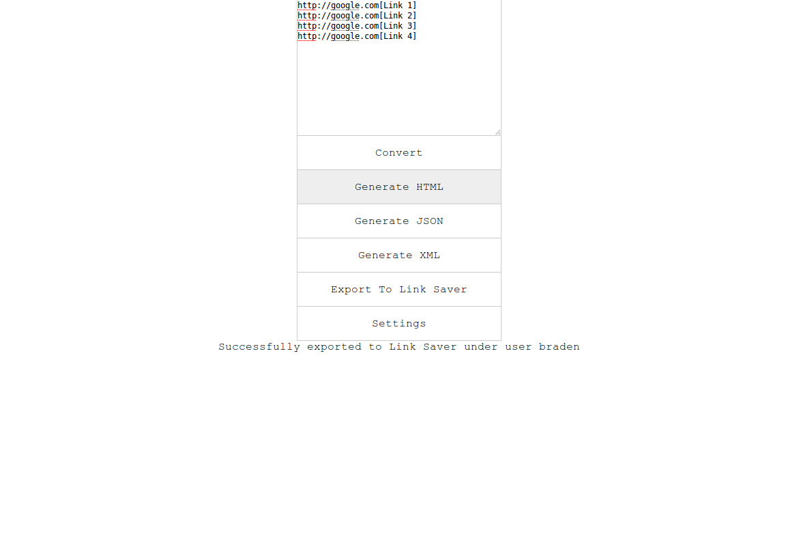

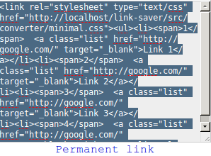

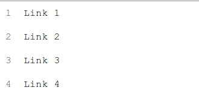

### Features

* small footprint
* support for export
  * to HTML
  * to JSON
  * to XML
  * to Link Saver
* easily convert large batches of URLs to clickable links

### Issues

* Not the most intuitive interface
* Ultra-strict with how URLs are formatted

### Format

The format is `url[Title]`, and `[Title]` is optional, for example:
* `http://google.com[Google]` will render [Google](http://google.com)
* `http://github.com`         will render http://github.com

Here is an example of a few links:

    http://google.com[Link 1]
    http://google.com[Link 2]
    http://google.com[Link 3]

    http://google.com[Link 4, separated by an empty line]

This will render like so:

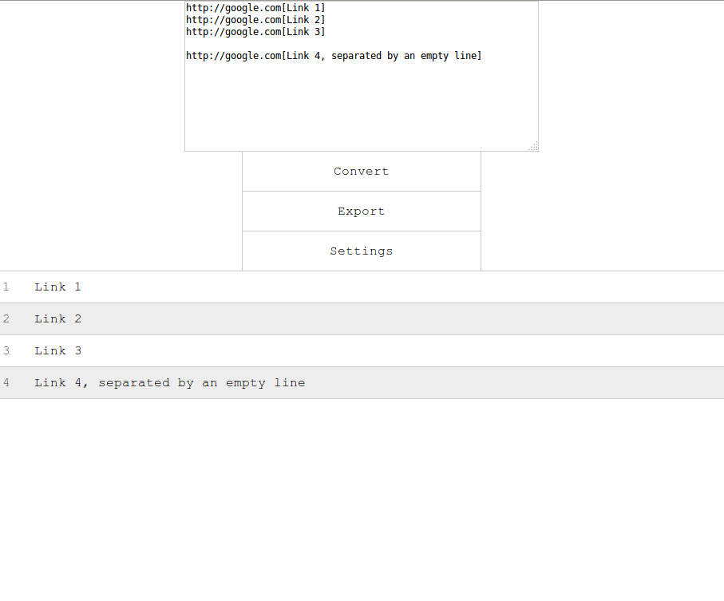

## Cli

This is a wrapper for the Link Saver App (documented in src/Client/Help.html) that uses a command-line interface. 

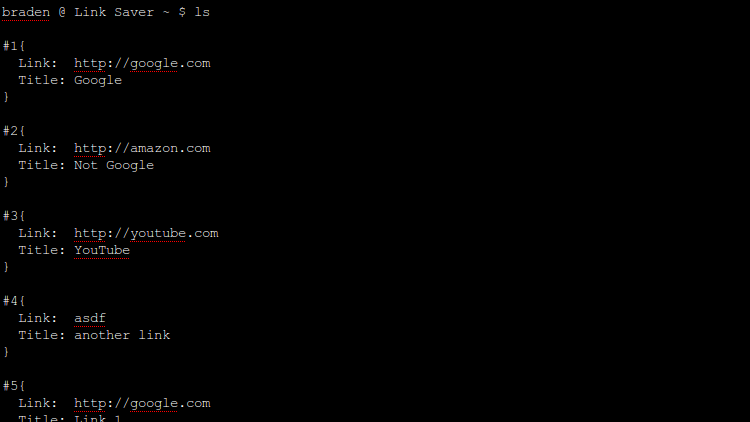

### Features

* Batch jobs (e.g. `rm 1 5` will delete links 1 - 5)
* less footprint

### Issues

* I woudln't call it stable
* Not even close to finished

## Developer

I've added a bash shell script in src/ called `search`. To use it:

    $ ./search "content"

It will then look for "content" in every file, and return a detailed log containing files and line numbers where matches were found. Try it!

    $ ./search include
