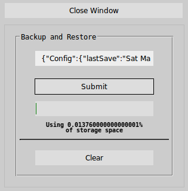
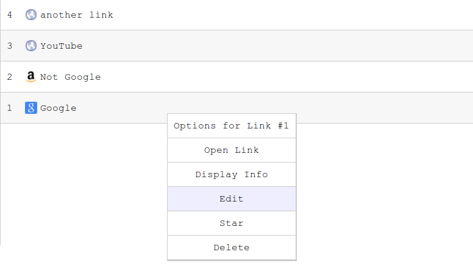

# Link Saver by Braden Best

The Link Saver is a project I made to replace bookmarks and provide a clean UI instead. Cause in my opinion, browser bookmark systems suck.

## What's new

* new data model
  * This version saves everything into one localStorage entry
* more stable
* cleans up the UI with a head menu
* adds Search functionality
* adds options menu

## Data

From Link_Saver.html

    Link Engine.data: Object: { 
      X: Object: {  [Each is a Paradigm, contains links]
        link.0:{
          link:[link],
          title:[title],
          removed:[true/false],
          starred:[true/false]
        },
        ...
      },
      LSPAR: [Reserved] Object: { [Paradigm list and pointer contained here]
        key:[key], (this controls X)
        list:{
          [listitem]:[listitem],
          ...
        }
      },
      #CONFIG: [Reserved] Object: { [contains miscellaneous Config data]
        property:boolean/number/string,
        ...
      }
      Note: Attempting to name an X object (Paradigm) "LSPAR" or "#CONFIG" will result in a failure notice. 
      Not because there are bugs involved, but because it is reserved
    }

It's evident that I still stuck with that stupid "recycle bin" method of deleting links.

