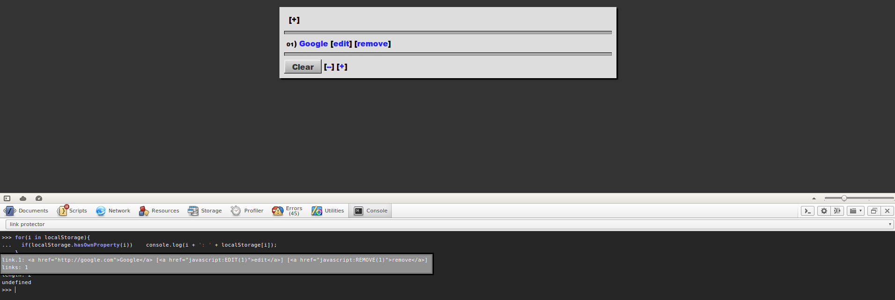

# Link Saver by Braden Best

The Link Saver is a project I made to replace bookmarks and provide a clean UI instead. Cause in my opinion, browser bookmark systems suck.

This was the first version. It's horrible. Please don't use it.

## Why is this version horrible?

This was initially an experiment I made when HTML5 Web Storage (`localStorage` and `sessionStorage`) first came out and had been adopted by all major browsers (chrome/webkit, opera/presto, firefox/gecko)

As for IE support, don't make me laugh.

Anyways, two major problems:

1. I didn't know json was a thing, so I just stored every single link in its own localStorage entry. 

2. I, for some reason, decided to store the entire HTML node instead of just the title and URL. Not only is this just bad practice, but this means the underlying mechanism for editing links meant using regexes to split and change the string. This often lead to errors with the paradigm system. Fatal Errors.

All in all, this version is a huge mess. And the way links are stored in this version means that after a little while, your localStorage would look like this:

    link.1: "<a href="http://somesite.com/somepath">sometitle</a>"
    link.2: "<a href="http://somesite.com/somepath">sometitle</a>"
    link.3: "<a href="http://somesite.com/somepath">sometitle</a>"
    link.4: "<a href="http://somesite.com/somepath">sometitle</a>"
    link.5: "<a href="http://somesite.com/somepath">sometitle</a>"
    link.6: "<a href="http://somesite.com/somepath">sometitle</a>"
    link.7: "<a href="http://somesite.com/somepath">sometitle</a>"
    link.8: "<a href="http://somesite.com/somepath">sometitle</a>"
    link.9: "<a href="http://somesite.com/somepath">sometitle</a>"
    link.10: "<a href="http://somesite.com/somepath">sometitle</a>"
    link.11: "<a href="http://somesite.com/somepath">sometitle</a>"
    link.12: "<a href="http://somesite.com/somepath">sometitle</a>"
    link.13: "<a href="http://somesite.com/somepath">sometitle</a>"
    link.14: "<a href="http://somesite.com/somepath">sometitle</a>"
    link.15: "<a href="http://somesite.com/somepath">sometitle</a>"
    links: 16
    anotherparadigm.1: "<a href="http://somesite.com/somepath">sometitle</a>"
    anotherparadigm.2: "<a href="http://somesite.com/somepath">sometitle</a>"
    anotherparadigm.3: "<a href="http://somesite.com/somepath">sometitle</a>"
    anotherparadigm.4: "<a href="http://somesite.com/somepath">sometitle</a>"
    anotherparadigm.5: "<a href="http://somesite.com/somepath">sometitle</a>"
    anotherparadigm.6: "<a href="http://somesite.com/somepath">sometitle</a>"
    anotherparadigm.7: "<a href="http://somesite.com/somepath">sometitle</a>"
    anotherparadigms: 8

Yeah, I think you get the idea. In fact, it's actually _worse_ than that. I forgot that I also put the EDIT and DELETE link for each link in there as well. Here's a screenshot of the link saver with one link:

Not to mention, if I remember correctly, the [DFE](http://www.urbandictionary.com/define.php?term=delete%20fucking%20everything) button didn't even delete all the storage items that the app created. Fail.

Also, I totally forgot, this version didn't have "paradigms" yet. So the next version, version 1.1.0, is the one that's even more horrible and cluttered.
sometitle

http://somesite.com/somepath
